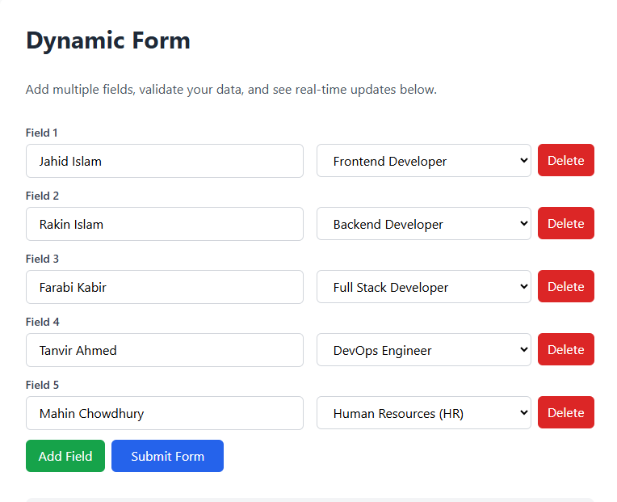
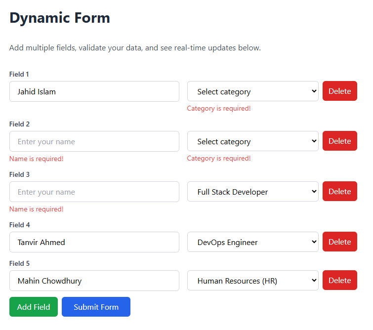
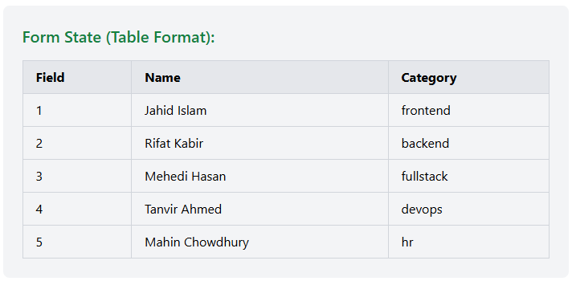
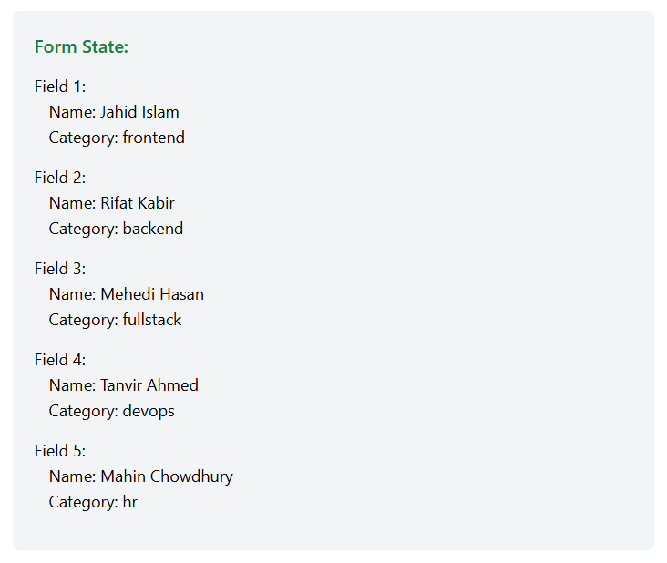

# Dynamic Form Builder

A responsive and interactive form builder built with React and Tailwind CSS. This project demonstrates dynamic field management, real-time validation, and component-based architecture.

## 🚀 Features

- ✅ **Dynamic Field Management** - Add/remove input-select field pairs
- ✅ **Real-time Validation** - Client-side form validation with error messages
- ✅ **State Display** - Live form state visualization in table format
- ✅ **Component Architecture** - Modular and reusable React components
- ✅ **Minimum Field Protection** - Prevents deletion of the last field

## 🛠️ Tech Stack

- **React** - Frontend library
- **Vite** - Build tool and dev server
- **Tailwind CSS** - Utility-first CSS framework
- **JavaScript (ES6+)** - Programming language

## 📦 Installation

1. Clone the repository:
```bash
git clone https://github.com/Zulkar-Jahin/Dynamic-Form-Builder.git
cd Dynamic-Form-Builder
```

2. Install dependencies:
```bash
npm install
```

3. Start the development server:
```bash
npm run dev
```

4. Open your browser and navigate to `http://localhost:5173`

## 🎯 Usage

1. **Add Fields** - Click the "+ Add Field" button to add new input-select pairs
2. **Fill Form** - Enter name and select category for each field
3. **Delete Fields** - Click "Delete" button to remove unwanted fields (minimum 1 required)
4. **Submit** - Click "Submit Form" to validate and submit
5. **View State** - See real-time form state in the table below

  ## 📸 Screenshots
  
  
  
  
  

## 📂 Project Structure

```
Dynamic-Form-Builder/
├── src/
│   ├── components/
│   │   ├── FormField.jsx          # Individual form field component
│   │   ├── FormStateTable.jsx     # Table display component
│   │   └── FormStateH3.jsx        # Alternative display (archived)
│   ├── App.jsx                    # Main application component
│   ├── App.css                    # Application styles
│   ├── index.css                  # Global styles with Tailwind
│   └── main.jsx                   # Application entry point
├── public/
├── package.json
├── vite.config.js
└── README.md
```


## 🧩 Components

### `FormField`
Renders a single input-select field pair with validation errors.

**Props:**
- `item` - Field data object
- `index` - Field index
- `errors` - Validation errors array
- `fieldNumber` - Display number
- `onInputChange` - Input change handler
- `onSelectChange` - Select change handler
- `onDelete` - Delete handler

### `FormStateTable`
Displays form state in a table format.

**Props:**
- `formData` - Array of form field data

## ✨ Key Features Implementation

### Dynamic Field Addition
```javascript
const handleAddField = () => {
  const newField = { id: nextId, name: "", category: "" };
  setFormData([...formData, newField]);
  setNextId(nextId + 1);
};
```

### Field Validation
```javascript
const validateForm = () => {
  const newErrors = [];
  formData.forEach((item) => {
    const itemError = { id: item.id, name: "", category: "" };
    if (!item.name.trim()) itemError.name = "Name is required!";
    if (!item.category) itemError.category = "Category is required!";
    newErrors.push(itemError);
  });
  setErrors(newErrors);
  return !newErrors.some(error => error.name || error.category);
};
```

## 🎨 Styling

This project uses **Tailwind CSS** for styling with a focus on:
- Clean and modern UI
- Responsive design
- Smooth transitions


## 🔧 Scripts

```bash
# Development server
npm run dev

# Build for production
npm run build

# Preview production build
npm run preview
```

## 🚀 Deployment

Build the project for production:
```bash
npm run build
```

The optimized files will be in the `dist/` folder, ready for deployment.

## 👨‍💻 Author

**Zulkar Jahin**
- GitHub: [@Zulkar-Jahin](https://github.com/Zulkar-Jahin)

## 📄 License

This project is open source and available under the MIT License.

